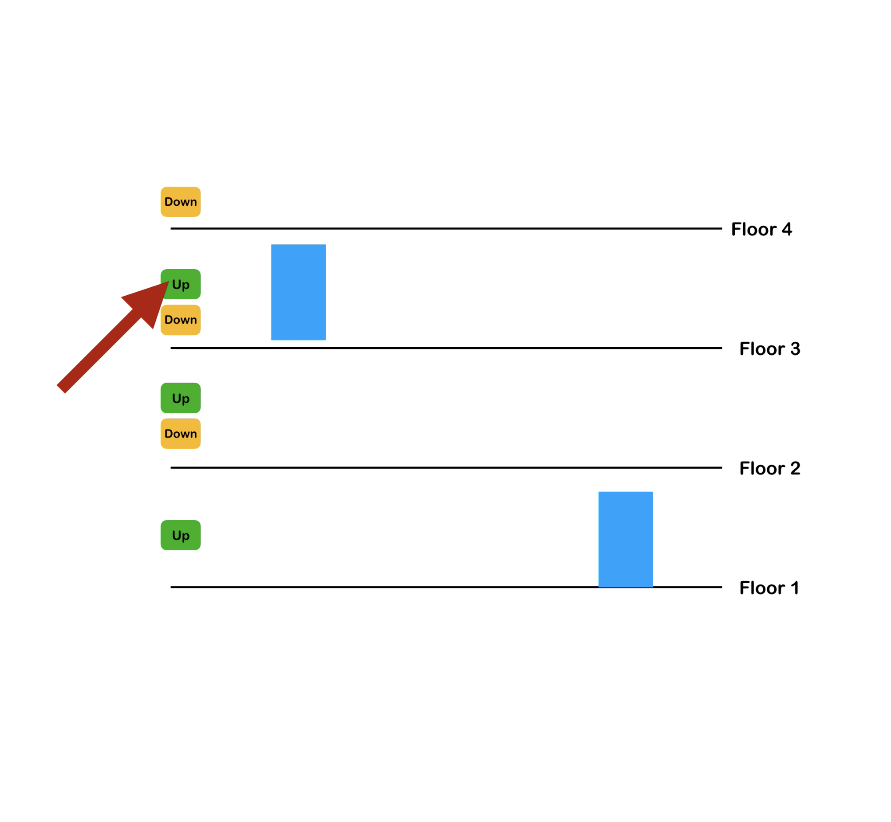

# Lift-Simulation
Create a web app where you can simulate lift mechanics

# UI Example

# Requirements
  - Have a page where you input the number of floors and lifts from the user
  - An interactive UI is generated, where we have visual depictons of lifts and buttons on floors
  - Upon clicking a particular button on the floor, a lift goes to that floor

  Create three major parts to your project:
    - Data store that contains the state of your application data
    - JS Engine that is the controller for which lift goes where
    - Dumb UI that responds to controller's commands
